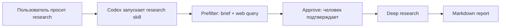

# Deep Research Codex

Локальный раннер для research-задач поверх [GPT Researcher](https://github.com/assafelovic/gpt-researcher).

Идея проекта - сделать локальный аналог Deep Research-режима из ChatGPT и Claude, но запускать его из Codex как skill:

- Codex принимает research-задачу обычным языком
- prefilter превращает ее в понятный brief и web query
- человек подтверждает запрос перед платным поиском
- GPT Researcher делает deep research по web-источникам
- результат сохраняется как markdown-файл

Внутри репозитория уже лежит встроенная и модифицированная версия оригинального `gpt-researcher`, а сверху добавлен `research.sh` и Codex skill.

## Зачем это

Это нужно, когда хочется похожий на Deep Research workflow, но локально и с большим контролем:

- можно использовать свои API-ключи
- параметры глубины, ширины и лимитов лежат в локальной конфигурации
- результат сохраняется как обычный markdown-файл
- workflow меньше зависит от ограничений конкретного web-интерфейса

## Что нужно из API

Поиск сейчас идет через [Tavily](https://app.tavily.com):

- `TAVILY_API_KEY`

LLM-вызовы в этом wrapper из коробки рассчитаны на AWS Bedrock:

- `FAST_LLM`, `SMART_LLM`, `STRATEGIC_LLM` в формате `bedrock:<model_id>`
- `EMBEDDING=bedrock:amazon.titan-embed-text-v2:0`
- `AWS_DEFAULT_REGION`
- один из вариантов авторизации: `AWS_PROFILE`, AWS key pair или `AWS_BEARER_TOKEN_BEDROCK`

Оригинальный GPT Researcher поддерживает много LLM-провайдеров: OpenAI, Anthropic, Azure OpenAI, Google, Groq, Mistral, OpenRouter, Ollama, Bedrock и другие. Но текущий `research.sh` проверяет именно `bedrock:*` модели, потому что локальный workflow тестировался и настраивался под Bedrock/Claude.

## Что лежит в репозитории

- `research.sh` - основной вход для запуска исследования
- `scripts/` - вспомогательные скрипты
- `gpt-researcher/` - встроенный исходный код GPT Researcher
- `skills/research/` - Codex skill для запуска этого workflow из агента
- `.env.example` - пример конфигурации

## Установка

```bash
git clone https://github.com/mikemelanin/deep-research-codex.git
cd deep-research-codex
python3 -m venv .venv
./.venv/bin/pip install -r gpt-researcher/requirements.txt boto3
cp .env.example .env
```

После этого заполни `.env` своими ключами Tavily и доступом к AWS Bedrock.

Важно:

- встроенный `gpt-researcher` уже включен в этот репозиторий, отдельно скачивать его не нужно
- `.env` локальный и не публикуется в git
- по умолчанию результат сохраняется в `~/Downloads`

## Установка как Codex skill

Чтобы Codex мог запускать workflow как skill:

```bash
mkdir -p ~/.codex/skills
cp -R skills/research ~/.codex/skills/research
```

Если репозиторий лежит не в `~/deep-research-codex`, укажи путь к нему:

```bash
export DEEP_RESEARCH_CODEX_HOME="/path/to/deep-research-codex"
```

После этого в Codex можно просить обычным языком:

```text
Сделай research по теме ...
Собери markdown-отчет с источниками ...
Сделай deep research на русском ...
```

Skill использует двухшаговый режим: сначала показывает нормализованный brief/query, потом запускает платное web research только после подтверждения.

## Быстрый запуск

Обычный запуск:

```bash
./research.sh "Тема исследования"
```

По умолчанию раннер:

- запускает deep research
- использует локальный профиль по умолчанию `4/2/4`
- сохраняет итоговый отчет на английском

Сразу получить русский итоговый отчет:

```bash
./research.sh --ru "Тема исследования"
```

## Полезные режимы

Сделать только prefilter и сохранить артефакт:

```bash
./research.sh --prefilter-only "Тема исследования"
```

Продолжить из уже сохраненного prefilter-артефакта:

```bash
./research.sh --from-prefilter "./logs/YYYYMMDD-HHMMSS-prefilter.json"
```

Пропустить подтверждение brief/query:

```bash
./research.sh --yes "Тема исследования"
```

Передать markdown-файл как входной запрос:

```bash
./research.sh --file "./context.md"
```

Короткий вариант без `--file`:

```bash
./research.sh "./context.md"
```

Старые флаги совместимости тоже работают:

```bash
./research.sh --deep "Тема исследования"
./research.sh --no-translate "Тема исследования"
./research.sh --en "Тема исследования"
```

## Как устроен workflow



1. Входной текст или markdown-файл воспринимается как сырой запрос.
2. Prefilter LLM превращает его в нормализованный `Research task` и короткий web query.
3. В интерактивном запуске раннер просит подтвердить результат prefilter перед платным поиском.
4. После подтверждения запускается GPT Researcher с `report_source=web`.
5. Итоговый отчет сохраняется в markdown.
6. Если указан `--ru`, после этого делается перевод финального отчета на русский.

Важно:

- по умолчанию используется тип отчета `deep`
- markdown-файл не подмешивается как локальный knowledge source, а используется как текст запроса

## Куда сохраняются результаты

- итоговый отчет по умолчанию: `~/Downloads/YYYY-MM-DD-topic.md`
- исходный английский отчет GPT Researcher: `gpt-researcher/outputs/<uuid>.md`
- логи и prefilter-артефакты: `./logs/`

## Сравнение deep-профилей

Можно прогнать встроенное сравнение нескольких deep-профилей на одной теме:

```bash
./.venv/bin/python scripts/compare_deep_profiles.py "Тема исследования"
```

Этот сценарий:

- создает один общий `prefilter.json`
- запускает три deep-профиля на одном и том же нормализованном запросе
- сохраняет отдельные `report/log/telemetry`
- пишет `comparison-summary.md` и `comparison-summary.json` в `logs/<timestamp>-deep-compare-.../`
